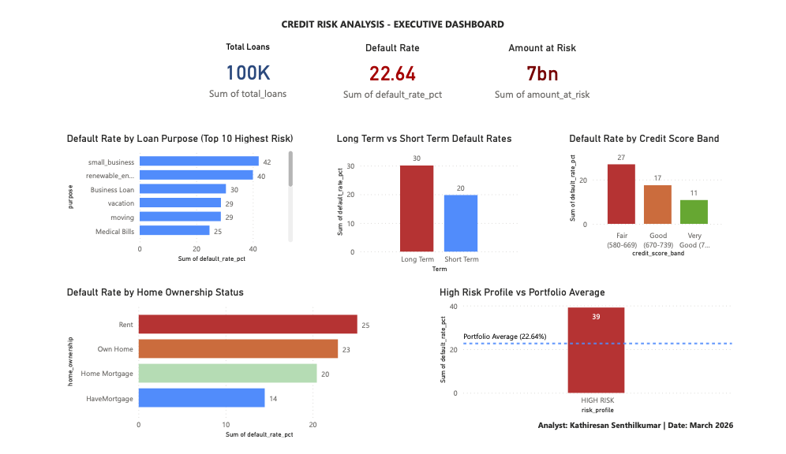

# Credit Risk Analysis — End to End Data Analysis

**Analyst:** Kathiresan Senthilkumar  
**Tools:** MySQL, Excel  
**Dataset:** loan_data — 100,514 rows, 19 columns  
**Type:** End to End Data Analysis  

---

## Business Question

> *What borrower characteristics predict default — and what does a high risk borrower profile look like?*

---

## Dataset Overview

| Column | Description |
|---|---|
| Loan ID | Unique loan identifier |
| Customer ID | Unique borrower identifier |
| Loan Status | Fully Paid / Charged Off — target variable |
| Current Loan Amount | Total loan value |
| Term | Short Term / Long Term |
| Credit Score | Borrower credit score |
| Annual Income | Borrower annual income |
| Years in Current Job | Employment stability |
| Home Ownership | Rent / Own Home / Home Mortgage |
| Purpose | Reason for loan |
| Monthly Debt | Current monthly debt obligations |
| Years of Credit History | Length of credit history |
| Months Since Last Delinquent | Recency of payment issues |
| Number of Open Accounts | Active credit lines |
| Number of Credit Problems | Count of prior credit issues |
| Current Credit Balance | Outstanding balance |
| Maximum Open Credit | Credit limit |
| Bankruptcies | Prior bankruptcy filings |
| Tax Liens | Outstanding tax liens |

---

## Data Quality Findings

Before any analysis — data quality checks were run on every key column.

| Issue | Detail | Decision |
|---|---|---|
| Null rows | 514 rows with no data across all columns | Excluded — filtered WHERE Loan Status IS NOT NULL |
| Credit Score nulls | 19,154 records missing Credit Score | Excluded from Credit Score analyses |
| Credit Score outliers | 4,551 records with score above 850 (max valid = 850) | Excluded — filter BETWEEN 300 AND 850 |
| Annual Income outliers | Max value $165M, avg $1.37M — clearly erroneous | Income analysis abandoned — data unreliable |
| Home Ownership inconsistency | 'HaveMortgage' and 'Home Mortgage' appear to be the same category | Flagged — should be cleaned in production |

**Clean working dataset: 100,000 rows after null removal.**

---

## Analysis Structure

7 sections driving from portfolio overview to high risk borrower identification.

---

### Section 0 — Data Quality and Overview

Four quality checks before any business analysis.

Verified null counts, distinct status values, Credit Score range validity, and outlier volume.

---

### Section 1 — Portfolio Health Overview

**Finding:** 22,639 out of 100,000 loans charged off. **22.64% default rate.** Industry healthy range is 2-5%. $7.36 billion in loans at risk from defaults.

---

### Section 2 — Default Rate by Loan Purpose

**Finding:** Business lending carries the highest default risk.

| Purpose | Default Rate |
|---|---|
| Small Business | 42.05% |
| Renewable Energy | 40.00% (sample n=10) |
| Business Loan | 30.47% |
| Debt Consolidation | 22.81% |
| Buy a Car | 16.05% |

Debt Consolidation dominates by volume — 78,552 loans, $6.06B at risk.  
Buy a Car is the safest category at 16.05%.

---

### Section 3 — Default Rate by Loan Term

**Finding:** Long Term loans default 52% more than Short Term loans.

| Term | Default Rate | Amount At Risk |
|---|---|---|
| Long Term | 30.10% | $3.63B |
| Short Term | 19.77% | $3.72B |

Despite Short Term having 2.6x more loans, the amount at risk is nearly equal — Long Term loans are significantly larger in individual value.

---

### Section 4 — Default Rate by Home Ownership

**Finding:** Renters default most. Mortgage holders are safest.

| Home Ownership | Default Rate |
|---|---|
| Rent | 25.11% |
| Own Home | 22.89% |
| Home Mortgage | 20.47% |

Renters have the least financial stability and no asset to leverage — consistent with credit risk theory.

---

### Section 5 — Default Rate by Credit Problems

**Finding:** Credit problems are a weak predictor until 4 or more problems.

Default rate barely changes from 0 to 3 problems (22.64% to 23.79%).  
Rate spikes at 4+ problems — 28% at 4, 34.69% at 5.  
Records with 6+ problems have sample sizes too small for reliable analysis.

---

## Section 5.2 — Default Rate by Credit Score Ranges

**Objective:** Identify the optimal credit score threshold for loan approval decisions.

### Q5.2.1 — Data Quality Check

After filtering to valid FICO range (300–850), scores span only 585–751.
Poor (300–579) and Excellent (800–850) bands contain zero records.
Valid records for this analysis: **76,295**

### Q5.2.2 — Default Rate by Credit Score Band

| Credit Score Band | Total Loans | Default Rate | Amount At Risk |
|---|---|---|---|
| Fair (580–669) | 5,506 | **26.93%** | $626.7M |
| Good (670–739) | 52,987 | 17.47% | $2.95B |
| Very Good (740–799) | 17,802 | **10.77%** | $525.3M |

Every 70-point increase in credit score roughly halves the default rate.

**Recommendation:** Set minimum approval threshold at 670. Loans below this default at nearly triple the rate of Very Good borrowers.

### Q5.2.3 — Average Score: Fully Paid vs Charged Off

| Loan Status | Avg Credit Score |
|---|---|
| Fully Paid | 718 |
| Charged Off | 710 |

Only 8 points separate the two groups — confirming credit score alone is a moderate predictor. The high-risk profile combination in Section 7 remains the strongest default indicator.

**Files:** `credit_risk_EDA_credit_score.sql` | `Credit_Score_Analysis.xlsx`
---

### Section 6 — Income Band Analysis

**Finding: Abandoned due to data quality.**

Annual Income column contains severe outliers — minimum $76,627, maximum $165,557,393, average $1,378,277. Only 3,629 records fall within a realistic income range. Analysis would mislead rather than inform. Documented and skipped.

---

### Section 7 — High Risk Borrower Profile

**The final answer to the business question.**

Combining all findings — the highest risk borrower is:

- Taking a **Long Term** loan
- For **Small Business or Business** purposes
- Currently **Renting**
- With **1 or more prior credit problems**

**Result: 39.13% default rate — 73% above the portfolio average of 22.64%.**

---

## Section 8 — Process Reperformance: Loan Amount Integrity

**Objective:** Independently verify whether reported loan amount figures are trustworthy.

**Trigger:** Maximum loan amount of $99,999,999 identified during exploratory checks — flagged as a potential sentinel value.

### Q8.1 — Scale of Contamination

11,484 records (11.48%) contain the sentinel value 99,999,999.  
88.52% of records have real loan amounts.

### Q8.2 — Reported vs Reperformed Metrics

| Metric | Reported | Reperformed | Variance | Status |
|---|---|---|---|---|
| Total Loan Amount | $1.176 Trillion | $27.6 Billion | $1.148T overstated | 🚨 UNRELIABLE |
| Average Loan Amount | $11,760,447 | $312,314 | $11.4M overstated | 🚨 UNRELIABLE |
| Amount at Risk | $7,357,114,160 | $7,357,114,160 | $0 | ✅ RELIABLE |
| Avg Charged Off Loan | $324,975 | $324,975 | $0 | ✅ RELIABLE |

### Q8.3 — Root Cause Confirmation

| Loan Status | Sentinel Count | Sentinel % |
|---|---|---|
| Fully Paid | 11,484 | 14.84% |
| Charged Off | 0 | 0.00% |

**Root cause:** Sentinel values are concentrated 100% in Fully Paid loans — zero in Charged Off loans. Likely cause: legacy system overwrites loan amount field with maximum value (99,999,999) upon loan payoff.

### Reperformance Conclusion

The reported total portfolio of $1.176 trillion is overstated by $1.148 trillion. However the amount at risk figure of $7.36 billion and all default rate percentages are fully reliable — sentinel values did not affect Charged Off loan records.

**Files:** `credit_risk_EDA_reperformance.sql` | `Credit_Risk_Reperformance.xlsx`

---

## Key Recommendations

1. **Implement strict approval criteria for long term business loans to renters with prior credit history.** This profile defaults at nearly double the portfolio average. Require collateral or co-signers, or decline entirely pending risk review.

2. **Review business lending strategy.** Small Business (42.05%) and Business Loan (30.47%) categories are far above acceptable default thresholds. Consider tighter income verification and business viability assessment.

3. **Reprice long term loans.** 30.10% default rate on long term loans suggests current interest rates do not adequately compensate for the elevated risk. Actuarial repricing recommended.

4. **Investigate Annual Income data quality.** The income column is currently unusable for analysis. Fixing the data entry error (likely missing decimal points) would unlock an additional predictive variable for risk modeling.

5. **Standardise Home Ownership values.** The 'HaveMortgage' vs 'Home Mortgage' inconsistency should be resolved in the data pipeline before production reporting.

---

## SQL Concepts Applied

- SELECT with WHERE filtering
- GROUP BY with multiple aggregates — COUNT, SUM, ROUND
- CASE WHEN inside SELECT for conditional counting
- CASE WHEN inside GROUP BY for income banding
- Data quality checks — null auditing, outlier detection
- Comparative analysis — portfolio average vs segment performance
- Multi-condition WHERE filtering for profile identification

---

## Power BI Dashboard

Executive summary dashboard built in Power BI visualising key findings.

---

## About The Analyst

Data professional with 2+ years at Amazon in ML data operations and quality analytics.  
Skilled in SQL and Advanced Excel with hands-on experience in data quality validation, anomaly detection, and process improvement.  
Building toward Data Analyst roles in fintech, ecommerce, and analytics-driven organisations.

LinkedIn: linkedin.com/in/kathiresansenthilkumar  
GitHub: github.com/Star-P1atinum  
Email: kathir.nsmb@gmail.com
